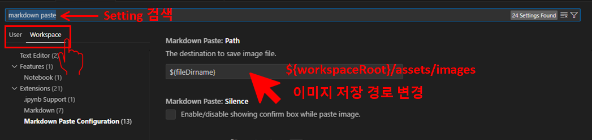

## 배경과 목표

`Markdown Paste Plugin`로 Markdown 문서에 Image를 붙이는데 특정 프로젝트에서는 정해진 경로에 붙이고 싶다.

Ex) Jekyll기반 Blog를 쓸때는 `{BlogHome}/assets/images/` 에다가 붙여야함. Default value is `${fileDirname}`.

### 목표

- Workspace별 설정을 이해하고 Blog Workspace의 Markdown Paste의 Image경로를 바꾼다.

## 본론

### User Setting과 Workspace Setting 그리고 Default Setting

VSCODE의 Setting에는 총 3가지가 있다. `User`, `Workspace`, `Default`. 각각의 셋팅에 따라서 `Setting.json` 파일도 있다. 

Setting을 변경하는 방법도 `UI`를 통한 방법고 `JSON`파일을 직접 바꾸는 2가지 방법이 있다.

이번 경우는 **
# Please enter the commit message for your changes. Lines starting
# with '#' will be ignored, and an empty message aborts the commit.
#
# On branch main
# Your branch is ahead of 'origin/main' by 1 commit.
#   (use "git push" to publish your local commits)
#
# Changes to be committed:
#	modified:   _posts/vscode/2024-06-09-[01]_Workspace_specific_settings.md
#
**을 바꾸면 된다.

### 바꾸기

- Setting열기: `Ctrl + Shift + p` -> Setting UI 입력
- Workspace Setting 선택
- Markdown Paste Setting 변경
  - 주) Markdown Plugin이랑 다른 애니까 헷갈리지 말자.
  - Blog의 경우에는: `${workspaceRoot}/assets/images`로 변경하였음

## 결론

Workspace별로 셋팅값을 바꿀 수 있다는 것을 알았고, Markdown Paste에 적용 Image에 대한 경로를 변경하여 적용하였다. Mission 완료!

참고로 이 셋팅은 Workspace -> `.vscode` -> `settings.json` 파일에 저장된다.

따라서 이 파일을 지우면 설정이 삭제된다. 
